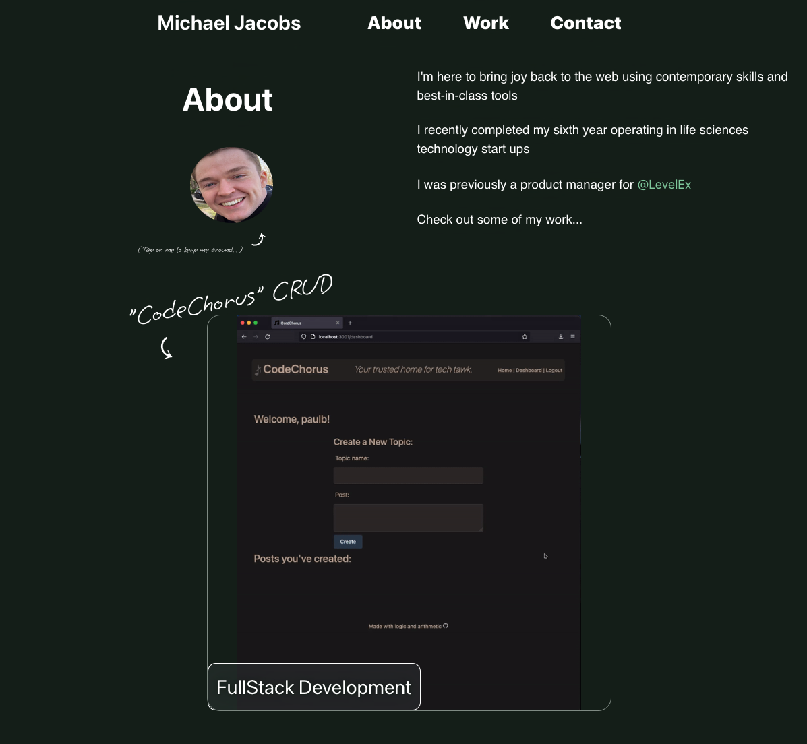
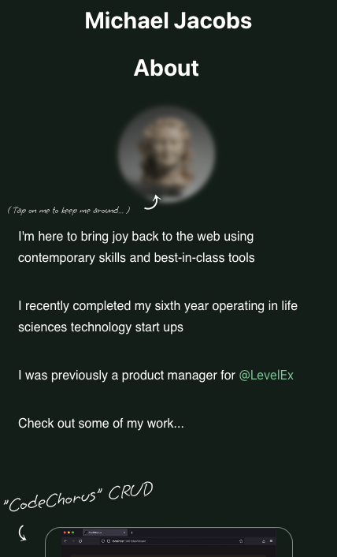
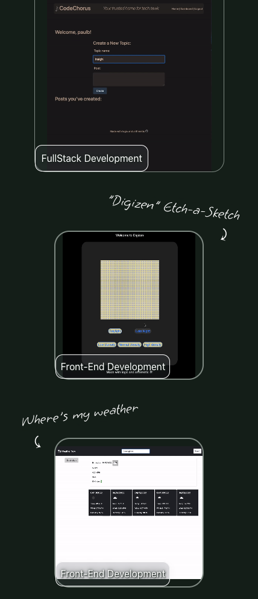

# SeeMyWork

## Description

This repository contains the a single page web app used to display a mobile-friendly summary of current and past work.

## Technologies
- React.js
- HTML5
- CSS3
- Javascript
- Bootstrap

## Links
See it live:  [See My Work](https://mcjbyday.github.io/seemywork/)

## Usage

In project root:

        `npm run start`

Runs the app for use in development mode.

At [http://localhost:3000](http://localhost:3000) the application can be viewed in browser.

    
## Screenshots
| Image | Description |
| --- | ----------- |
|  | Desktop  |
|  | Mobile Page Top |
|  | Mobile Page Mid |

## References
Product images sourced from Level Ex, Inc. and Medtronic, PLC websites

## Other

No external installations are required to view this website. 

## Contact
Comments or questions?  
Author: Michael Jacobs  
Email: jacobsmichaelc@gmail.com  
GitHub: [https://github.com/mcjbyday](https://github.com/mcjbyday)  